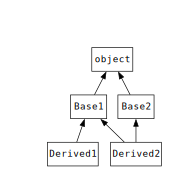

# Where we left off

## Context Managers

There is a convenient way of creating context managers: [`@contextlib.contextmanager`](https://docs.python.org/3.10/library/contextlib.html#contextlib.contextmanager).

BUT! This requires we use
* [**decorators**](https://docs.python.org/3.10/glossary.html#term-decorator), a type of [Higher-order function](https://en.wikipedia.org/wiki/Higher-order_function#:~:text=In%20mathematics%20and%20computer%20science,a%20function%20as%20its%20result.)
* [**generator iterators**](https://docs.python.org/3.10/glossary.html#term-generator-iterator), which are best seen as a *stream* or *process*

*Type theory* provides an interesting and useful common conceptual framework for understanding these entities.  It has powerful relationships with different forms of logic, and it's generalization eventually leads to [Category theory](https://en.wikipedia.org/wiki/Category_theory).

## Recommended reading:

* [Types and Programming Languages - Benjamin C. Pierce](https://www.amazon.com/Types-Programming-Languages-MIT-Press/dp/0262162091)
* [Category Theory for Programmers](https://bartoszmilewski.com/2014/10/28/category-theory-for-programmers-the-preface/)
* [Lectures on the Curry-Howard Isomorphism](https://disi.unitn.it/~bernardi/RSISE11/Papers/curry-howard.pdf)
---

# Type Theory: Outlook

**GOAL**: We should know enough type theory to understand the [*JSON type*](https://www.json.org/json-en.html) -- i.e. we should be able to write a type in our favorite language which contains any object described by *JSON*.

## Path forward

* Review Python's type-system
    - `class` and *algorithmic subtyping*
    - *nominal subtyping* vs *structural subtyping*
    - different ways of introducing types and aliases
* Extract the fundamental abstractions from Python's type-system
    - remove unnecessary operators, "noise" and other information not interesting to mathematics
    - develop some notations
* Develop a set-theoretic "implementation" of our abstract type-system
    - what does that mean?
    - let $\mathcal{O_2}$ denote the open subsets of $\mathbb{R}^2$.  Is $\mathcal{O_2} \in \pi$?  Is that even a valid query?
    - little review of set theory (i.e. the *data model* of mathematics)
* Demonstrate the relationship between logic and type-theory
    - Brief introduction to the *Curry-Howard correspondence*
* Recursive types
    - Infinite tree types
    - Regular tree types and their relationship with [*regular languages*](https://en.wikipedia.org/wiki/Regular_language)
    - $\mu$-notation
* Polymorphism
    - Subtype polymorphism
    - Parametric polymorphism
    - Ad-hoc polymorphism and dependent types.


## Executive summary

* Practically speaking, a *type* is metadata associated to a variable or parameter in a program.
* Proper use of *type annotations* and a *type checker* can help ensure program correctness.
* Different *type systems* have different expressive power - some are even turing complete.
* Some tools are capable of *type inference,* which can reduce tedious and error prone coding practices.
* Some languages offer the ability to read, and even modify, information about types *at runtime.*  Such techniques are broadly called *reflection.*
* **TODO:** Mention abstract interpretation


# Review of Python's type system

## Type Annotations

* `29-Sep-2014` [PEP 526 – Syntax for Variable Annotations](https://peps.python.org/pep-0526/#non-goals)
* `19-Dec-2014` [PEP 483 – The Theory of Type Hints](https://peps.python.org/pep-0483/)
* `08-Jan-2015` [PEP 482 – Literature Overview for Type Hints](https://peps.python.org/pep-0482/)
* `09-Aug-2016` [PEP 484 – Type Hints](https://peps.python.org/pep-0484/#non-goals)

## Nominal Subtyping

* "Nominal Subtyping" refers to the "name-based" class hierarchies you can create in most OOP languages.

```py
class Base1:
    x: int

class Base2:
    y: int

class Derived1(Base1):
    y: int

class Derived2(Base1, Base2):
    pass
```



Pros:
* simple, easy to implement and understand
* traditional, explicit

Cons:
* many "essentially equivalent types" (see `Derived1` and `Derived2`)
* traditional, explicit

## Towards structural subtyping
* Protocols
* Abstract Base Classes

Consider the following classes:

```python
class Point2D:
    x: int
    y: int

class PointZ2:
    x: int
    y: int
```

In *nominal subtyping* we have that `Point2D` and `PointZ2` are incomparable.  But we can carelessly use an instance of one in place of the other, as long as we don't use information about the *type*.

Suppose we forget about the *names* of classes, and focus on the *fields.*  We would like to define a *type* that represents all classes with an `x: int` and a `y: int` field.  This leads to *structural subtyping*, known in python as [`typing.Protocol`](https://peps.python.org/pep-0544/#protocol-members).  It's all quite interesting and useful, but it's a technical complication that we should further abstract.

# A simplified type system

Let's now forget about the names of *fields,* and focus on the *type* and *offset*.  For example, we could represent `Point2D` and `PointZ2` as a `tuple[int,int]`.  Observe:

```python
def isomorphism(point_or_tuple) -> 'tuple_or_point':
    if isinstance(point_or_tuple, tuple): return Point2D(t[0], t[1])
    else: return (point_or_tuple.x, point_or_tuple.y)
```


# A simplified type system

* [`Callable`](https://docs.python.org/3.10/library/typing.html#callable)
* [`tuple` and PEP 585 – Type Hinting Generics In Standard Collections](https://peps.python.org/pep-0585/)

## Base Types (Built-in types)

[The standard type hierarchy](https://docs.python.org/3.10/reference/datamodel.html#the-standard-type-hierarchy)

The *essential* types

* **`None`**
* **`bool`**
* **`tuple`**
* **`Callable`**
* We'll probably use **`int`** just to make our discussions more *concrete*

Other special types:

* Specials
    - `NotImplemented`
    - `Ellipsis`
* Numeric
    - `float`
    - `complex`
* Immutable Sequences
    - `str`
    - `bytes`
* Mutable Sequences
    - `list`
    - `bytearrays`
    - `complex`
* Miscellaneous
    - sets, dicts, functions, classes, generators, coroutines...

## Abstraction: the operators and built-ins that we need...

* **`bool`**
* Product
* Function
* Subtype...

Let's also notice that we can restrict our consideration to functions of only one variable.  Consider:

```python
def curry(f: Callable[[T, U], R]) -> Callable[[T], Callable[U, R]]:
    return lambda t: lambda u: f(t, u)
```

In principle, we should only need to consider the `None` type, but we'll also allow `int`, `bool`, and `str` to make our type system feel more "concrete."

Our type system will then be:

* Built-in types `None`, `int`, `bool`, and `str`, however we will typically use sets $0 = \empty, 1 = \{0\}, \dots,n+1 = \{n\}\cup n$
* for any types `T1`, `T2`, ..., `TN`, a *product type* `tuple[T1, T2, ..., TN]`, or $T_1 \times T_2 \times \cdots \times T_n$
* for any types `T`, `U`, a *function type* `Callable[T, U]`, or $T \rightarrow U$

We will take a subset of python as our the *language* we will consider.  Our language $Py$ will consist of:

## Declarations

**Variable Declaration**

```python
x: int
f: Callable[[int], str]
```

**Type Aliases**

```python
T = str
U = int
f: Callable[T,U]
```

## Expressions

**Tuple Formation and Indexing**

```python
(x, y)
t[0]
```

**Function call**

```python
f(s)
```

## Context

We will adopt the following convention.  We will always consider a fixed *context* (or $\Gamma$), where all our declarations will be placed.  This way we can focus on the *expressions*, the interesting part of our language.

## Typing

Consider the following typing rules.

* if `x: T` and `f: Callable[[T], U]` then `f(x): U`
* if `t: tuple[T1, T2, ..., TN]` and `i: int` and `1 <= i <= n`, then `t[i]: Ti`

# The Curry-Howard correspondence

Consider the following statements:

* If I know that $\phi$ is true, and I know that $\phi \Rightarrow \psi$, then I know that $\psi$ is true
* If I know that $\phi_1 \land \phi_2 \land \cdots \land \phi_n$ is true, then for an $i: 1\leq i\leq n$, $\phi_i$ is true

These are remarkably similar to our typing rules.  These statements describe a framgent of *propositional logic* consisting of $\{\land, \Rightarrow\}$.  We shall investigate this relationship now.

## Interpretation (set-theoretic implementation)

Typically, when we describe an abstraction, we would like to make sure that it actually exists (more specifically, that it's possible for it to exist).  The study of this pursuit is known as *Model Theory.*  We'll keep it simple (for my sake), and state the following purpose:

> Implement our type system and fragment of logic with sets and set theory.

Hopefully, after "implementing" our abstractions, we will see more clearly the connection between the two.

### Logic

The fragment's grammar is:

* $T \mapsto p$ where $p,q,r,\dots$ are variables
* $T \mapsto T \land T \dots \land T$
* $T \mapsto T \Rightarrow T$

A *context* for our grammar, denoted $\Gamma$, is a subset of the propositional variables.  Specifically, we will take $\Gamma$ to be the variables that get assigned **true**.  We need to create a system of sets and operations so that the semantics given by the rules above are satisfied.

There is a straightforward way of doing this, but some notation will be helpful.  We use variable like $\phi$ and $\psi$ to range of the fragment.  We use the notation $\mathrm{Set}(\phi)$ to denote the set which represents $\phi$ in our model.  We define the function $\mathrm{Set}()$ inductively:

* if $p$ is **true**, then $\mathrm{Set}(p) = \{\empty\}$, otherwise $\mathrm{Set}(p) = \empty0$
* $\mathrm{Set}(\phi \land \psi) = \mathrm{Set}(\phi) \times \mathrm{Set}(\psi)$
* $\mathrm{Set}(\phi \Rightarrow \psi) = \mathrm{Set}(\psi)^{\mathrm{Set}(\phi)}$

**Exercise:** verify that the above interpretation does indeed satisfy the semantics of our fragment.

### Types

We use the mathematical notation $T \rightarrow U$ and $T \times U$ for `Callable` and `tuple`, respectively.

* $\mathrm{Set}(T)$ is any set with cardinality equal to the cardinality of $T$ (we suppose "collisions" are avoided...)
* $\mathrm{Set}(T \times U) = \mathrm{Set}(T) \times \mathrm{Set}(U)$
* $\mathrm{Set}(T \rightarrow U) = \mathrm{Set}(U)^{\mathrm{Set}(T)}$

**Exercise:** verify that the above interpretation does indeed satisfy the semantics of our fragment.

## The Big Idea

Let's see if we can use type theory to directly model logic.  We need an *empty type* `Never` and a type with one inhabitant: `None`.  Proceeding as obviously as possible, we inductively define

* $\mathrm{Type}(p)$ is `None` if $p$ is true, otherwise `Never`
* $\mathrm{Type}(A \land B)$ is $\mathrm{Type}(A)\times\mathrm{Type}(B)$
* $\mathrm{Type}(T \rightarrow U) = \mathrm{Type}(U)^{\mathrm{Type}(T)}$

**Exercise:** verify that the above interpretation does indeed satisfy the semantics of our fragment.

We must observe that we have a problem with $\land$ and $\times$ - one is symmetric, while the other is not.  This hasn't been a problem now because $0 \cdot 1 = 1 \cdot 0 = 0$.  To fix this "assymetry," we need to continue our abstractive process from earlier.  First, we forgot the names of *types*, then we forgot the names of *fields*, giving them all an index instead.  Now we must also forget about the *index,* and discover a generalization which does not depend on *position.*  Here's our requirements:

* $\mathrm{Type}(A \land B) = \mathrm{Type}(B \land A) \simeq \mathrm{Type}(A) \times \mathrm{Type}(B)$
* We need two functions: $\pi: \mathrm{Type}(A \land B) \rightarrow A$ and $\rho: \mathrm{Type}(A \land B) \rightarrow B$

This line of thinking naturally leads to the [*categorical product*](https://en.wikipedia.org/wiki/Product_(category_theory)).  We will be satisfied in knowing that this inconsistency is not all that important - once we resolve the symmetry issue we'll be left with an object that is *isomorphic* to $\mathrm{Type}(A) \times \mathrm{Type}(B)$, so it seems like if we would rather just use $\mathrm{Type}(A) \times \mathrm{Type}(B)$ then we can.

<!-- | Type Theory | Logic | Note |
|--|--|--|
| Type | Proposition | *Types ARE Propositions, built-in types ARE Propositional Variables*
| implementation | proof | type-checking is proof-verification |
| $\rightarrow$ | $\Rightarrow$ | *It may be that $\phi$ implies $\psi$, but $\phi \Rightarrow \psi$ IS a proposition* |
| $\times$ | $\land$ | *Is $\times$ symmetric? Is $\land$ ?* |
| `\|` | $\lor$ |*Is* `\|` *symmetric? Is $\lor$ ?* | -->

### Math vs Programming

There is a cute asymmetry here in what is considered important.  A mathematician would like to get rid of all *unnecessary* information: the fact that we must refer to $0, 1 \in \mathbb{N}$ in order to get the values from our $\mathrm{Type}(A \land B)$ is unacceptable.  Why should the creation of a *product type* depend on our knowledge of *natural numbers?*  This is an unnecessary dependency, and we can get rid of it and replace our operators with more primitive notions.

A programmer, however, will probably want to be a little more pragmatic.  We also don't like unnecessary dependencies, but we are not going to be praised for writing code that does not depend on any notion of *number* (you *would* have, about 100 years ago...).  Plus, as engineers, we typically like to give ourselves useful, but contradictory advice:

* **KISS:** keep it simple stupid
* **WTPA:** (don't) waste time on pointless abstractions

On the one hand, by removing all dependencies we are making our program simpler.  There is no *our program is correct, assuming all the dependencies are properly implemented.*  On the other hand, we had better have a very good reason for introducing very strange objects and abstractions, and most people won't find the reason "we don't want to assume that numbers exist" very convincing (except for mathematicians - that's because they know that numbers don't really exist anyways).

### Axioma vs Programming

Here are some axioms from set theory:

| Axiom | Meaning | Use |
|--|--|--|
| Existence | A set exists | We know the universe is not *empty* |
| Extensionality | If two sets have the same elements they are equal | We can check for equality |
| ~~Foundation~~ | No set is an element of itself | Technical, hard to justify conceptually... |
| Comprehension | Subsets given by *formulas* are sets | Fundamental operation for creating new sets |
| Union | The union of any *family of sets* is a set | Fundamental operation for creating new sets |
| Replacement | The *range* of a *formula* is a set | Fundamental operation for creating new sets |
| Powerset | The set of all subsets of a set exists | Fundamental operation for creating new sets |
| ~~Infinity~~ | An infinite set exists | Construct $\omega$ (aka $\mathbb{N}$) |
| ~~Axiom of Choice~~ | All sets can be well ordered | Either AoC or something like it is required to develop analysis |

## Review of how math itself is implemented

# Curry howard correspondence


## Classic vs Intuitionist logic

## Disjoint Union

# Recursive types

## Intuition

## Formalities

### Infinite Tree Types

## Notation

## `JSON` excercise

# Polymorphism

## Subtype polymorphism

## Parametric polymorphism

## Ad-hoc polymorphism

## System-F

# General Discussion

## The basic problems in typing

## Complexity, decidability

## Which lambda terms can be given a type?